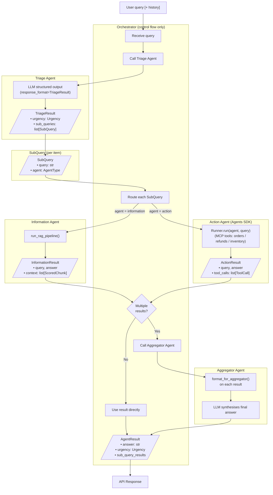
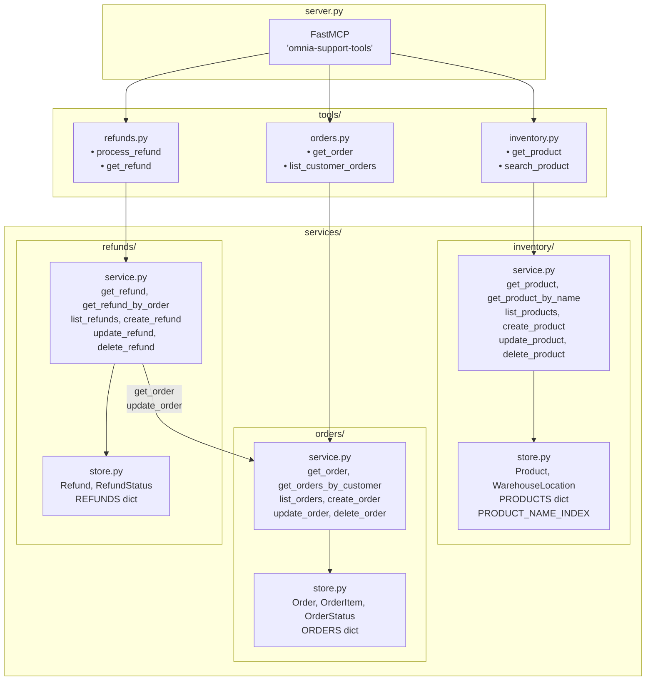
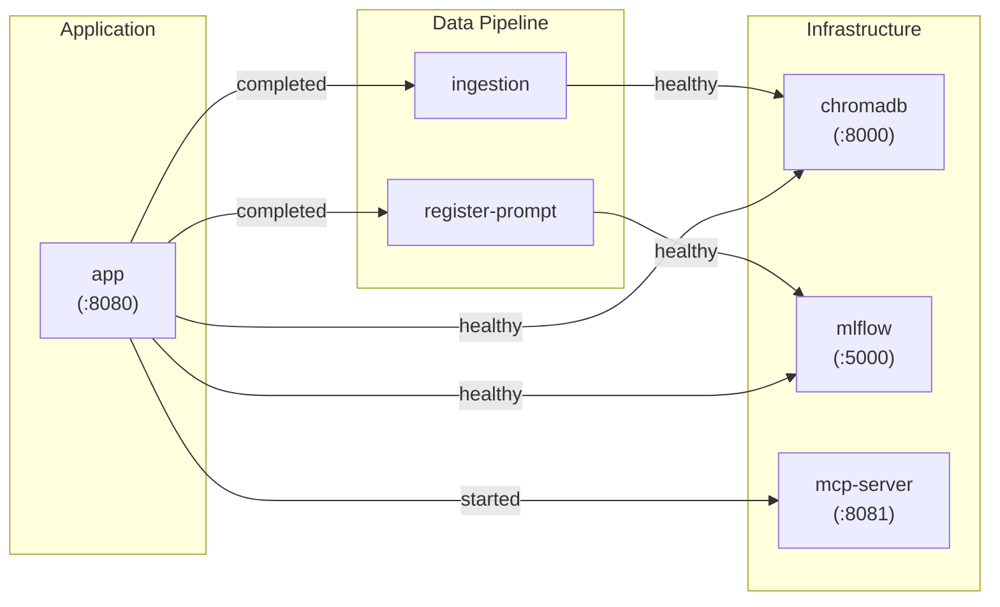
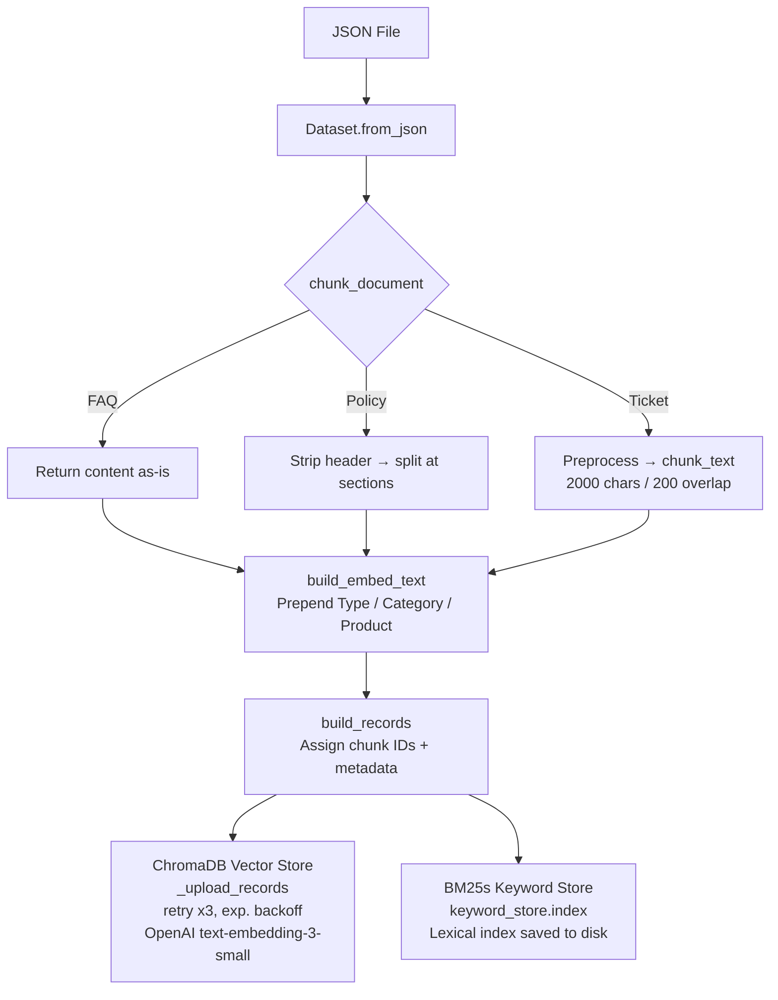
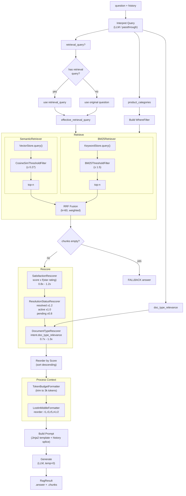

# Presentation

## Agent orchestrator

```mermaid
flowchart TD
    User["User query [+ history]"]

    subgraph Orchestrator["Orchestrator (control flow only)"]
        direction TB
        O_recv["Receive query"]
        O_triage["Call Triage Agent"]
        O_route["Route each SubQuery"]
        O_check{"Multiple\nresults?"}
        O_agg["Call Aggregator Agent"]
        O_pass["Use result directly"]
        Result[/"AgentResult\n• answer: str\n• urgency: Urgency\n• sub_query_results"/]
    end

    subgraph Triage["Triage Agent"]
        T_llm["LLM structured output\n(response_format=TriageResult)"]
        T_out[/"TriageResult\n• urgency: Urgency\n• sub_queries: list[SubQuery]"/]
    end

    subgraph SQ["SubQuery (per item)"]
        SQ_out[/"SubQuery\n• query: str\n• agent: AgentType"/]
    end

    subgraph InfoAgent["Information Agent"]
        I_rag["run_rag_pipeline()"]
        I_out[/"InformationResult\n• query, answer\n• context: list[ScoredChunk]"/]
    end

    subgraph ActionAgent["Action Agent (Agents SDK)"]
        A_run["Runner.run(agent, query)\n(MCP tools: orders / refunds / inventory)"]
        A_out[/"ActionResult\n• query, answer\n• tool_calls: list[ToolCall]"/]
    end

    subgraph AggAgent["Aggregator Agent"]
        R_fmt["format_for_aggregator()\non each result"]
        R_llm["LLM synthesises final answer"]
        R_fmt --> R_llm
    end

    API["API Response"]

    User --> O_recv --> O_triage
    O_triage --> T_llm --> T_out --> SQ_out
    SQ_out --> O_route

    O_route -->|"agent = information"| I_rag --> I_out
    O_route -->|"agent = action"| A_run --> A_out

    I_out --> O_check
    A_out --> O_check
    O_check -->|"Yes"| O_agg --> R_fmt
    O_check -->|"No"| O_pass --> Result
    R_llm --> Result --> API
```

## MCP server

```mermaid
flowchart TD
    subgraph server.py
        mcp["FastMCP\n'omnia-support-tools'"]
    end

    subgraph "tools/"
        inventory_tools["inventory.py\n• get_product\n• search_product"]
        orders_tools["orders.py\n• get_order\n• list_customer_orders"]
        refund_tools["refunds.py\n• process_refund\n• get_refund"]
    end

    subgraph "services/"
        subgraph "inventory/"
            inventory_svc["service.py\nget_product, get_product_by_name\nlist_products, create_product\nupdate_product, delete_product"]
            inventory_store["store.py\nProduct, WarehouseLocation\nPRODUCTS dict\nPRODUCT_NAME_INDEX"]
        end
        subgraph "orders/"
            orders_svc["service.py\nget_order, get_orders_by_customer\nlist_orders, create_order\nupdate_order, delete_order"]
            orders_store["store.py\nOrder, OrderItem, OrderStatus\nORDERS dict"]
        end
        subgraph "refunds/"
            refunds_svc["service.py\nget_refund, get_refund_by_order\nlist_refunds, create_refund\nupdate_refund, delete_refund"]
            refunds_store["store.py\nRefund, RefundStatus\nREFUNDS dict"]
        end
    end

    mcp --> inventory_tools
    mcp --> orders_tools
    mcp --> refund_tools

    inventory_tools --> inventory_svc
    orders_tools --> orders_svc
    refund_tools --> refunds_svc

    inventory_svc --> inventory_store
    orders_svc --> orders_store
    refunds_svc --> refunds_store

    refunds_svc -->|"get_order\nupdate_order"| orders_svc
```

## Services (app profile)

```mermaid
flowchart LR
    subgraph Infrastructure
        chromadb["chromadb\n(:8000)"]
        mlflow["mlflow\n(:5000)"]
        mcp-server["mcp-server\n(:8081)"]
    end

    subgraph "Data Pipeline"
        ingestion["ingestion"]
        register-prompt["register-prompt"]
    end

    subgraph Application
        app["app\n(:8080)"]
    end

    ingestion -->|healthy| chromadb
    register-prompt -->|healthy| mlflow

    app -->|healthy| chromadb
    app -->|healthy| mlflow
    app -->|completed| ingestion
    app -->|completed| register-prompt
    app -->|started| mcp-server
```

## Ingestion pipeline

```mermaid
graph TD
    A[JSON File] --> B[Dataset.from_json]
    B --> C{chunk_document}

    C -->|FAQ| D[Return content as-is]
    C -->|Policy| E[Strip header → split at sections]
    C -->|Ticket| F[Preprocess → chunk_text\n2000 chars / 200 overlap]

    D --> G[build_embed_text\nPrepend Type / Category / Product]
    E --> G
    F --> G

    G --> H[build_records\nAssign chunk IDs + metadata]

    H --> I[ChromaDB Vector Store\n_upload_records\nretry x3, exp. backoff\nOpenAI text-embedding-3-small]
    H --> J[BM25s Keyword Store\nkeyword_store.index\nLexical index saved to disk]
```

## RAG pipeline

```mermaid
flowchart TD
    Input["question + history"] --> Interpret["Interpret Query\n(LLM / passthrough)"]

    Interpret --> retrieval_query["retrieval_query?"]
    Interpret --> product_cat["product_categories"]
    Interpret --> doc_type_rel["doc_type_relevance"]

    retrieval_query --> HasRewrite{has retrieval\nquery?}
    HasRewrite -- yes --> UseRewrite["use retrieval_query"]
    HasRewrite -- no --> UseOriginal["use original question"]
    UseRewrite --> EffQuery["effective_retrieval_query"]
    UseOriginal --> EffQuery

    product_cat --> BuildWhere["Build WhereFilter"]

    EffQuery --> Retrieve
    BuildWhere --> Retrieve

    subgraph Retrieve["Retrieve"]
        direction TB
        subgraph Semantic["SemanticRetriever"]
            VQ["VectorStore.query()"] --> CosineFilter["CosineSimThresholdFilter\n(≥ 0.27)"]
            CosineFilter --> SemTopN["top-n"]
        end
        subgraph BM25["BM25Retriever"]
            KQ["KeywordStore.query()"] --> BM25Filter["BM25ThresholdFilter\n(≥ 1.5)"]
            BM25Filter --> BM25TopN["top-n"]
        end
        SemTopN --> RRF["RRF Fusion\n(k=60, weighted)"]
        BM25TopN --> RRF
    end

    RRF --> Empty{"chunks empty?"}
    Empty -- yes --> Fallback["FALLBACK answer"]

    Empty -- no --> Rescore

    subgraph Rescore["Rescore"]
        direction TB
        Sat["SatisfactionRescorer\nscore x f(star rating)\n0.8x - 1.2x"]
        --> Res["ResolutionStatusRescorer\nresolved x1.2\nactive x1.0\npending x0.8"]
        --> DocType["DocumentTypeRescorer\nintent.doc_type_relevance\n0.7x - 1.3x"]
    end

    doc_type_rel --> DocType

    DocType --> Reorder["Reorder by Score\n(sort descending)"]

    subgraph Context["Process Context"]
        direction TB
        TokenBudget["TokenBudgetFormatter\n(trim to 3k tokens)"]
        --> LostMiddle["LostInMiddleFormatter\nreorder: r1,r3,r5,r4,r2"]
    end

    Reorder --> Context

    LostMiddle --> BuildPrompt["Build Prompt\n(Jinja2 template + history splice)"]
    BuildPrompt --> Generate["Generate\n(LLM, temp=0)"]
    Generate --> Result["RagResult\n.answer + .chunks"]
```